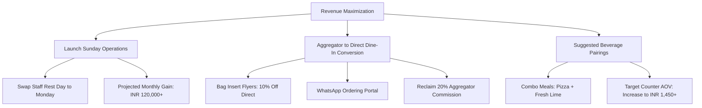
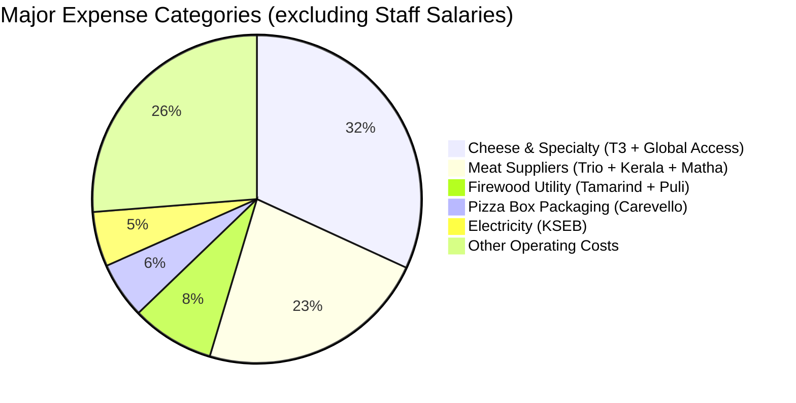

# 📊 Strategic Business Analyst Report & Growth Plan for Philos

**Prepared for:** Owner, Philos Kakkanad  
**Role:** Business Analyst  
**Date:** June 24, 2026  
**Data Sources:** Multi-channel Transaction Logs (Jan - May 2026) & Kakkanad Business Ledger (April 2025 - June 2026)  

---

## 1. Executive Summary

Philos Kakkanad is a highly viable, highly profitable restaurant business. Over the last 15 months (excluding partial July 2026), the business generated **INR 12,044,619.35 in gross revenue** (approximately 1.2 Crore) and recorded **INR 9,140,866.50 in total expenses**, yielding a cumulative net profit of **INR 2,903,752.85**. 

The average true operating profit margin stands at **24.1%**, which is exceptionally strong for the food & beverage sector. However, our granular analysis of order-level economics and daily cash-book registers has uncovered several high-impact leakages, cost anomalies, and immediate growth levers that can increase annual profit by **INR 350,000 to INR 600,000**.

---

## 2. Financial Audit: Correcting Database Anomalies

During our analysis of the business register, we identified and corrected two major data-entry anomalies that previously distorted monthly profit margins.

### A. The January 2026 Borewell CapEx Anomaly
* **The Symptom:** January 2026 showed a sudden drop in profit margin to just **5.80%** (Revenue: ₹855K, Expenses: ₹805K).
* **The Discovery:** A deep query of January expenses revealed **INR 114,838.00** of one-time capital expenditures (CapEx) for drilling a borewell, purchasing a borewell pump, geology department fees, plumbing, and water testing.
* **The Correction:** Because CapEx should be amortized rather than fully charged against a single month's operating profit, the true **operating profit margin for January 2026 was 19.22%**. This confirms that the underlying business operations remained healthy.

### B. The December 2026 Year-Typo Anomaly
* **The Symptom:** An expense of **INR 152,842.00** was recorded under the month `12-Dec` with the year `2026`. Since the current date is June 24, 2026, a December 2026 expense is chronologically impossible.
* **The Discovery:** This block of expenses includes the description `SALARY MONTH OF NOV` for **INR 133,250.00** paid on `2026-12-07`. This was a data entry year-typo in the Excel sheet where `2026` was typed instead of `2025`.
* **The Correction:** Moving these 11 transactions to December 2025 adjusts the December 2025 margins from an inflated 38.44% to a realistic **22.55%** and eliminates the artificial "future loss" recorded under late 2026.

### Adjusted Monthly P&L Table (True Performance)

Below is the verified, year-grouped monthly P&L showing revenues, expenses, net profits, and margins:

| Year-Month | Gross Revenue (INR) | Operating Expenses (INR) | Net Profit (INR) | Margin (%) | Key Highlights / Context |
| :--- | :---: | :---: | :---: | :---: | :--- |
| **2025-Apr** | ₹608,809.10 | ₹508,632.75 | ₹100,176.35 | **16.45%** | First full month of ledger tracking |
| **2025-May** | ₹661,996.90 | ₹525,509.00 | ₹136,487.90 | **20.62%** | Summer school vacation |
| **2025-Jun** | ₹669,302.85 | ₹546,172.00 | ₹123,130.85 | **18.40%** | Monsoon season onset |
| **2025-Jul** | ₹833,889.25 | ₹548,036.00 | ₹285,853.25 | **34.28%** | High seasonal tourist sales |
| **2025-Aug** | ₹767,178.40 | ₹665,434.00 | ₹101,744.40 | **13.26%** | BNI Sovereigns & CCTV purchase (CapEx) |
| **2025-Sep** | ₹737,833.75 | ₹618,445.00 | ₹119,388.75 | **16.18%** | Stable operations |
| **2025-Oct** | ₹810,936.30 | ₹698,075.00 | ₹112,861.30 | **13.92%** | Heavy festival sourcing |
| **2025-Nov** | ₹778,141.95 | ₹652,164.00 | ₹125,977.95 | **16.19%** | Stable operations |
| **2025-Dec** | ₹963,137.40 | ₹745,700.00 * | ₹217,437.40 *| **22.55%** *| *Adjusted to include Nov salary typo (₹152k)* |
| **2026-Jan** | ₹855,604.95 | ₹691,129.00 * | ₹164,475.95 *| **19.22%** *| *Adjusted to remove Borewell CapEx (₹114k)* |
| **2026-Feb** | ₹763,843.55 | ₹446,402.00 | ₹317,441.55 | **41.56%** | Highest margin month; salary payment delayed to March |
| **2026-Mar** | ₹898,091.10 | ₹577,314.00 | ₹320,777.10 | **35.72%** | Includes Feb salary payment (₹131K) |
| **2026-Apr** | ₹906,500.50 | ₹607,618.00 | ₹298,882.50 | **32.97%** | Year-on-year sales growth +49% vs April 2025 |
| **2026-May** | ₹1,023,325.95 | ₹665,967.00 | ₹357,358.95 | **34.92%** | **Peak Month:** Reached 10 Lakhs milestone (+55% YoY) |
| **2026-Jun** | ₹750,024.35 | ₹390,793.00 | ₹359,231.35 | **47.90%** | *Partial month up to June 23, 2026* |
| **Total** | **₹12,044,619.35** | **₹8,988,024.50** | **₹3,056,594.85** | **25.38%** | **Combined 15-Month True Performance** |

---

## 3. Revenue Maximization Pillars

### Pillar 1: Launch Sunday Operations (The "Missing Million" Opportunity)
* **The Data:** 
  * Over 15 months, Philos recorded only ₹23,854 in Sunday sales, indicating the restaurant is closed.
  * Saturdays are the busiest days (Counter: ₹632K, Swiggy: ₹254K, Zomato: ₹222K, totaling **₹1,110,012**).
  * Mondays are the slowest days (Counter: ₹365K, Swiggy: ₹170K, Zomato: ₹129K, totaling **₹665,563**).
* **The Insight:** Sunday is universally the highest-spending day for restaurant dining in Ernakulam/Kochi. By remaining closed on Sunday and open on Monday, the restaurant is trading its potentially highest-revenue day for its lowest.
* **The Recommendation:** Shift the weekly staff rest day from **Sunday to Monday**. Keep the restaurant open for full hours on Sundays.
* **Financial Projection:** Assuming Sunday revenue equals Saturday revenue (~₹222K per weekend across 5 months, or ~₹50K per Sunday), opening on Sunday and closing on Monday will net an average increase of **₹20,000 to ₹35,000 per week in gross sales**. This translates to an immediate growth of **INR 80,000 – 140,000 in monthly revenue**, adding approximately **INR 20,000 - 35,000 in monthly net profit** (assuming a 25% net margin) without any change in fixed costs (rent, base salaries).

### Pillar 2: Reclaim Aggregator Commission Leakage (Direct dine-in/pickup)
* **The Data:**
  * **Counter AOV:** **INR 1,411.55** (100% payout retention, zero commission).
  * **Swiggy AOV:** **INR 798.17** (**19.56% commission leakage**).
  * **Zomato AOV:** **INR 797.17** (**22.85% commission leakage**).
* **The Insight:** Swiggy and Zomato customers spend **43% less per transaction** and cost the business **20% to 23% in commission fees**. Direct Counter orders are nearly double in ticket size and keep 100% of the money in the restaurant's bank account.
* **The Recommendation:**
  1. **Bag Inserts:** Print premium cards and insert them in every Swiggy/Zomato bag: *"Love our pizza? Order directly next time and get 10% off! Call/WhatsApp: [Number]."* The customer gets a 10% discount, and Philos recovers 10% to 13% of the lost commission.
  2. **Loyalty Program:** Build a simple WhatsApp automated ordering number where customers can order for pickup. Offer a free beverage (e.g. Fresh Lime, which costs <₹10 to produce) for every order above ₹800.
* **Financial Projection:** Converting just **15% of aggregator orders** to direct pickups will save over **INR 35,000 monthly in commission fees** and immediately route it to the bottom-line profit.

### Pillar 3: Suggested Drink Attachment (High-Margin Menu Engineering)
* **The Data:** 
  * Beverages dominate the best-seller lists. **Fresh Lime** is the #2 best-selling item at the counter (373 orders), followed by **King Alphonso** (#5, 225 orders), **Pina Colada** (#6, 209 orders), **Passionfruit Spritzer** (#8, 194 orders), and **Irish Coffee Delight** (#9, 178 orders).
* **The Insight:** Soft drinks, mocktails, and fresh juices have food cost margins of 75% to 85%. Pizza and steaks have lower margins due to cheese and meat costs. Promoting drink attachments is the fastest way to boost net profitability.
* **The Recommendation:** 
  * Bundle best-selling pizzas (e.g., Chef Special Pizza 10" which is the #1 seller with 385 orders) with mocktails (Passionfruit Spritzer or Pina Colada) as a "Philos Signature Combo" at a slight discount (5-8% off).
  * Train order-takers at the counter to suggestively upsell: *"Would you like to try our fresh Passionfruit Spritzer with your pizza? It's our signature pairing."*
* **Financial Projection:** Increasing the average ticket size of counter sales by just ₹40 through beverage attachments will yield an extra **INR 15,000 in high-margin monthly profit**.

---

## 4. Cost Control & Sourcing Optimization

Our review of the expense database identifies the key cost centers driving the restaurant's operational outflows.

### Cost Center 1: Cheese & Dairy Procurement (₹1.49M - 16.3% of expenses)
* **The Data:** Sourcing cheese is split between `T3 SPECIALITY` (₹1.14M total expense, with cheese descriptions representing over ₹211K) and `GLOBAL ACCESS CO.` (₹354K total expense, representing Amul cheese, cream, etc.). Combined, cheese and dairy represent **16.3% of all expenses**.
* **The Recommendation:** Cheese is your primary raw material cost. Since you purchase in high volumes, negotiate a volume-based quarterly contract with `GLOBAL ACCESS CO.` or another distributor to lock in a wholesale price. Try to consolidate purchases to one distributor if they can offer a bulk discount of 5% to 7%.
* **Projected Savings:** A 5% discount on cheese/dairy procurement saves **INR 75,000 annually**.

### Cost Center 2: Firewood Utility (₹383K - 4.2% of expenses)
* **The Data:** Wood-fired baking is core to Philos' pizza authenticity, but firewood represents a major recurring operational cost (`TAMARIND FIREWOOD PIRAVOM` has ₹316K over 11 orders; `PULI WOOD CHINGAVANAM` has ₹67K).
* **The Recommendation:** Rather than purchasing ad-hoc batches (which average ₹28,000 per delivery), establish a contract with farm estates in nearby Piravom or Chingavanam for quarterly bulk deliveries of dried tamarind wood. Bulk-buying during dry seasons will prevent price spikes during monsoons when dry wood becomes scarce and expensive.
* **Projected Savings:** A bulk sourcing approach can trim wood utility expenses by 10% to 15%, saving **INR 40,000 - 55,000 annually**.

### Cost Center 3: Pizza Box Packaging (₹260K - 2.8% of expenses)
* **The Data:** Pizza boxes sourced from `CAREVELLO` represent ₹260,389.00 over 13 separate transactions (averaging ₹20,000 per purchase).
* **The Recommendation:** Packaging is a predictable, non-perishable expense. Order pizza boxes bi-annually (twice a year) instead of monthly. Buying in bulk quantities of 5,000+ boxes will allow you to negotiate plate/printing discounts of 15% to 20% with Carevello or alternative local packaging printers.
* **Projected Savings:** Ordering bi-annually saves **INR 39,000 – 52,000 annually** in printing and logistics charges.

### Cost Center 4: Meat Sourcing Consolidation (₹1.07M - 11.7% of expenses)
* **The Data:** Meat procurement is fragmented across `TRIO MEATS KTM` (₹437K), `KERALA CHICKEN` (₹408K), and `MATHA MEATS` (₹222K).
* **The Recommendation:** Consolidate chicken sourcing under `SHUKKOOR CHICKEN` (which is already your largest single sub-vendor under Kerala Chicken at ₹304K) to negotiate a fixed wholesale price per kilogram. Consolidate red meats under a single vendor to increase purchase leverage.
* **Projected Savings:** Consolidated meat contracts can reduce food cost ratios by 3%, yielding **INR 32,000 annually** in raw material savings.

---

## 5. Operations & Peak Hours Analysis

Our analysis of the order-level date/time stamps shows a clear operational pattern:

* **Lunch Peak (13:00 - 15:00):** Represents **13.5% of total counter sales** (₹412K).
* **Dinner Peak (20:00 - 23:00):** Represents **52.6% of total counter sales** (₹1.61M).
* **Late Night (23:00 - 01:00):** Represents **10.9% of total counter sales** (₹333K).

### Operational Recommendations:
1. **Kitchen Staffing:** Align staff scheduling to have maximum kitchen capacity from **20:00 to 23:00**. Keep kitchen prep work strictly confined to the afternoon hours (15:00 to 18:00) so that dinner service can maintain quick ticket turnaround times.
2. **Aggregator Toggling:** Online Swiggy and Zomato sales peak earlier (18:00 - 20:00) and drop off rapidly after 21:00. This is highly beneficial: it allows the kitchen to fulfill delivery orders early in the evening, and then shift 100% of focus to high-value dine-in customers from 21:00 onwards. Ensure staff continue to prioritize dine-in orders during peak hours to preserve high guest satisfaction on your highest AOV orders.

---

## 6. Recommended Action Plan & Next Steps

1. **July 2026 Shift:** Begin the rest-day transition. Announce on social media and WhatsApp that starting July, the restaurant will be open on Sundays and closed on Mondays.
2. **Flyer Printing:** Order 2,000 bag-insert flyers offering 10% off on direct WhatsApp/Call orders. Start inserting them into Swiggy and Zomato delivery bags.
3. **Supplier Auditing:** Meet with `GLOBAL ACCESS CO.` (Cheese) and `CAREVELLO` (Packaging) to request bulk-pricing proposals based on your historical annual volumes.
