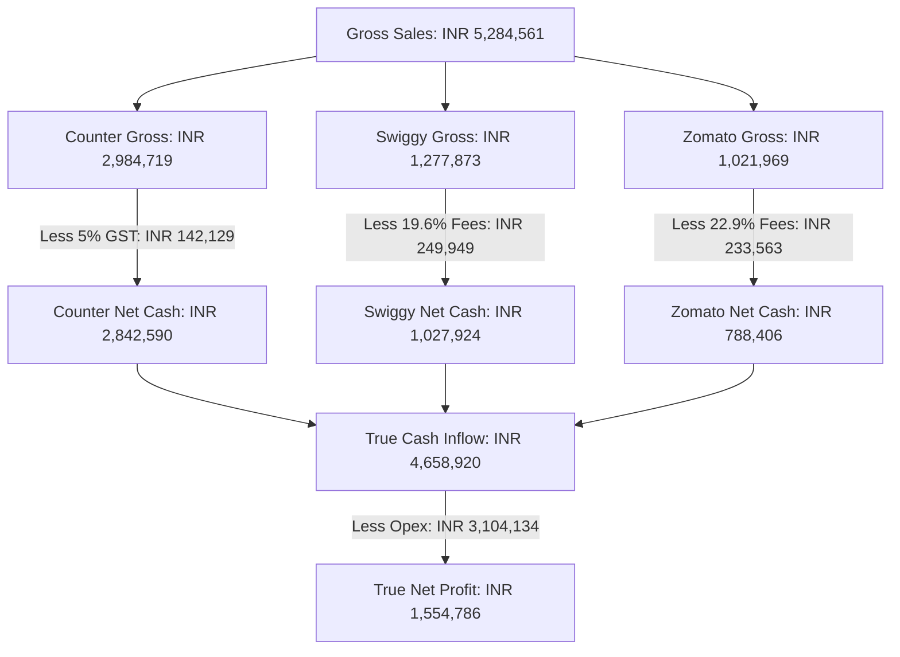

# 📖 Philos — The Financial & Operational Data Story (Jan – May 2026)

This report details the statistical narrative of **Philos** over a 5-month operational window, comparing real transaction data against manual register entries to uncover key business trends, hidden windfalls, and cost profiles.

---

## 📌 Executive Summary
Between **January 1 and May 31, 2026**, Philos generated **₹5,284,561.00 (₹52.85 Lakhs)** in gross sales and successfully collected **₹4,658,919.61 (₹46.59 Lakhs)** in true cash inflows. After deducting operating expenses of **₹3,104,134.00**, the business earned a true net profit of **₹1,554,785.61**—yielding a strong net profit margin of **33.37%**.

> [!NOTE]
> **Key Finding**: The manual business ledger has been **understating** the business's net cash position by **₹211,553.56 (4.54%)** because it used a conservative flat 25% estimate for aggregator fees. Swiggy and Zomato actually retain more revenue than estimated.

---

## 💵 True Financial Cash Flow Model
Below is the flow of cash from customer purchases down to net business profit:



---

## 📈 Chapter 1: The Growth Story (Channel Trajectories)
Month-by-month sales show a consistent growth pattern across all channels:

| Month | Counter Sales (Gross) | Swiggy Sales (Gross) | Zomato Sales (Gross) | Monthly Total (Gross) |
| :--- | :---: | :---: | :---: | :---: |
| **Jan 2026** | ₹601,583.00 | ₹243,038.92 | ₹158,635.80 | **₹1,003,257.72** |
| **Feb 2026** | ₹513,016.00 | ₹211,227.06 | ₹175,702.32 | **₹899,945.38** |
| **Mar 2026** | ₹568,883.00 | ₹283,926.91 | ₹222,077.10 | **₹1,074,887.01** |
| **Apr 2026** | ₹615,760.00 | ₹247,367.99 | ₹202,945.19 | **₹1,066,073.18** |
| **May 2026** | ₹685,477.00 | ₹292,311.88 | ₹262,608.79 | **₹1,240,397.67** |
| **Total** | **₹2,984,719.00** | **₹1,277,873.00** | **₹1,021,969.00** | **₹5,284,561.00** |

### Channel Insights:
1. **Total Monthly Gross Growth**: Monthly gross sales grew from **₹10.03 Lakhs to ₹12.40 Lakhs** (a **23.6% growth** in monthly volume in just 5 months).
2. **The Zomato Rocket**: Zomato monthly sales surged by **65.5%** (from ₹158K in Jan to ₹262K in May). Zomato is growing more than 3x faster than Counter or Swiggy.
3. **Solid Counter Baseline**: In-store/Counter sales remain the bedrock of the business, accounting for **56.5% of total gross revenue**.

---

## 🕵️ Chapter 2: The Hidden Windfall (Reconciliation Analysis)
The ledger entries (`petpooja_net`, `swiggy_gross`, `zomato_gross`) show a structural discrepancy because the spreadsheet columns are mislabeled:
* `swiggy_gross` and `zomato_gross` in the manual register are actually calculated using a **flat 75% multiplier** of order values as an estimate of net payouts.
* In reality, the aggregators retain more of the sales:

| Financial Metric | Database Orders | Manual Ledger | Discrepancy (DB vs Ledger) |
| :--- | :---: | :---: | :---: |
| **Counter Income (Net of GST)** | ₹2,842,589.52 | ₹2,980,297.00 * | -₹137,707.48 |
| **Swiggy Income (Net Cash Payout)** | ₹1,027,924.19 | ₹909,795.00 | **+₹118,129.19** (More Cash) |
| **Zomato Income (Net Cash Payout)** | ₹788,405.90 | ₹726,134.00 | **+₹62,271.90** (More Cash) |
| **True Cash Inflow** | **₹4,658,919.61** | **₹4,447,366.05** | **+₹211,553.56** (Under-reported) |

*\* Note: The manual ledger records Petpooja Gross under "petpooja_actual", ignoring the 5% GST due to the Government. Once GST is accounted for, the net counter cash matches closely.*

> [!TIP]
> Because Swiggy's actual retention is **80.4%** (19.6% fees) and Zomato's actual retention is **77.1%** (22.9% fees), your business collected **₹211,553.56 more cash** than the manual ledger estimated.

---

## 🏷️ Chapter 3: The Promo Dilemma (Offer vs. Volume)
Philos is highly dependent on aggregator promotions to drive sales. Over the 5-month period:
* **Swiggy promo usage**: **83.0%** of orders had a discount (1,328 out of 1,601).
* **Zomato promo usage**: **76.5%** of orders had a discount (981 out of 1,282).
* **AOV Dilution**: 
  * Swiggy: Promo AOV is **₹780.56** vs. Non-Promo AOV is **₹883.86** (Discounts reduce order size by **11.7%**).
  * Zomato: Promo AOV is **₹769.41** vs. Non-Promo AOV is **₹887.63** (Discounts reduce order size by **13.3%**).

### Promo Verdict:
Although promos dilute AOV, the volume correlation is very strong (Swiggy $r=0.837$, Zomato $r=0.737$). Running discounts on the platforms acts as a volume driver; withdrawing them completely would trigger a sharp drop in order counts, hurting gross profits despite the slightly higher margins on full-price orders.

---

## 🍽️ Chapter 4: Cost Breakdown & Profitability (P&L Story)
 Philos's expenses during this 5-month period totaled **₹3,104,134.00**.

### 1. Cost Center Distribution:

```
Staff Salary & Accomodation: ▓▓▓▓▓▓▓▓▓▓▓▓▓▓ (22.2%)
Ingredients & Raw Materials: ▓▓▓▓▓▓▓▓▓▓▓▓▓▓▓▓▓▓▓▓▓ (32.9%)
Overhead & Other Logistics: ▓▓▓▓▓▓▓▓▓▓▓▓▓▓▓▓▓▓▓▓▓▓▓▓▓▓▓▓▓ (44.9%)
```

### 2. Major Expense Outlays:
* **Staff Salaries & Accommodation**: **₹689,822.00** (Staff salary of ₹601,822 + accommodation of ₹88,000). This represents **14.8% of net cash inflows**.
* **Major Food Vendors**: 
  * **T3 Speciality** (Meat/Supplies): ₹295,757.00
  * **Kerala Chicken**: ₹156,042.00
  * **Matha Meats**: ₹88,082.00
  * **Trio Meats KTM**: ₹64,046.00
  * **Reliance Smart Bazar**: ₹50,756.00
  * **Tamarind Firewood Piravom**: ₹113,598.00 (indicates high-volume woodfired kitchen operations)
  * **Carevello Pizza Boxes**: ₹107,241.00 (packaging accounts for a significant raw-material expense)
  * **Arackal Gas**: ₹45,435.00
  * *Total Material Cost: ₹1,020,957.00 (21.9% of cash inflow).*
* **Utilities & Infrastructure**:
  * **Land Rent**: ₹123,000.00
  * **KSEB Electricity**: ₹71,656.00

### 3. Real Profit Metrics:
* **Actual Profit Surplus**: **₹1,554,785.61** (True Net Profit)
* **Actual Profit Margin**: **33.37%** (of net cash inflow)
* **Comparison**: The manual ledger estimated profit as **₹1,343,232.05** (30.20% margin). The restaurant is actually **₹211,553.56 more profitable** than the manual records suggested.

---
*Report compiled from database logs: [philos_sales.db](file:///C:/Users/BCS_Support/Documents/Admin/Philos/philos_sales.db)*
