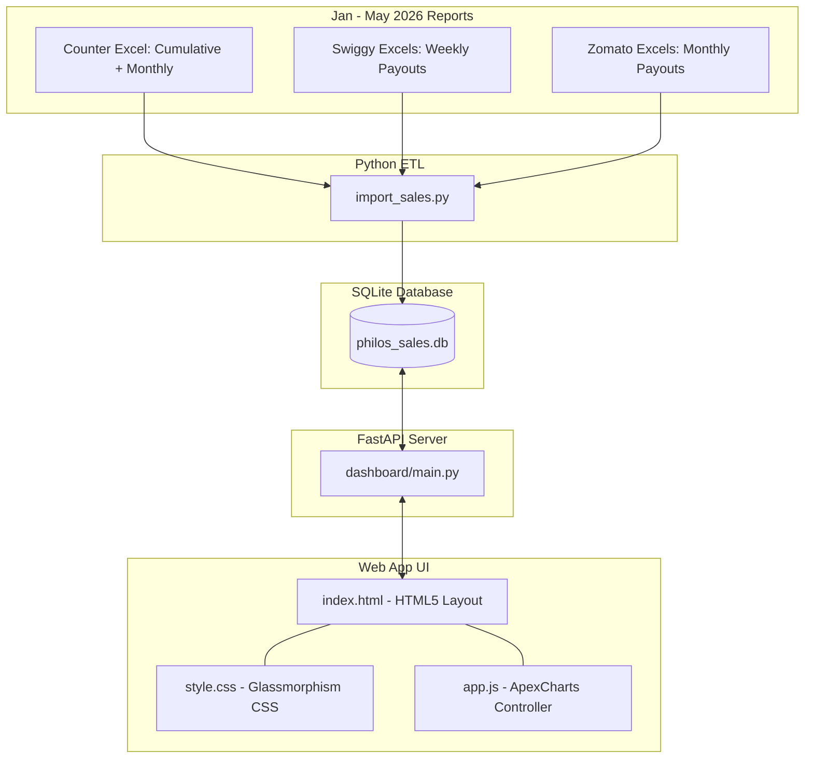
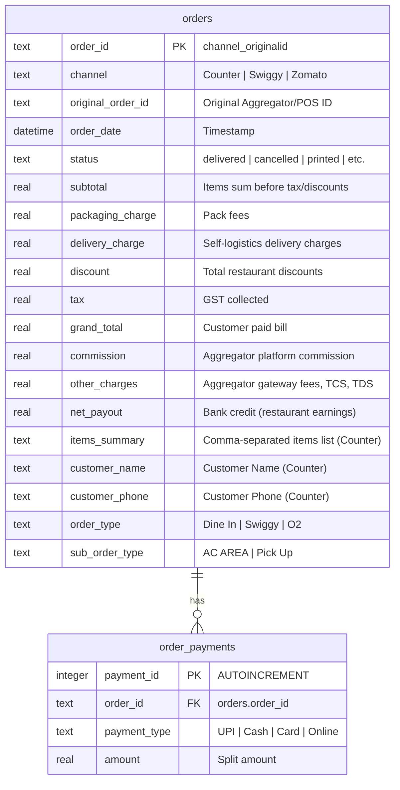

# Philos Sales Dashboard - Executive Strategy & Technical Blueprint

This document details the overall plan, database schema, data mappings, and UI/UX design strategy implemented to unify Philos' sales reports across Counter Sales, Swiggy, and Zomato into a single-source-of-truth business dashboard.

---

## 1. System Architecture

To avoid maintaining dozens of fragmented Excel sheets, we designed and built a lightweight, self-contained data pipeline and visualization web application.

---

## 2. Database Schema

The SQLite database ([philos_sales.db](file:///C:/Users/BCS_Support/Documents/Admin/Philos/philos_sales.db)) contains two tables, separating order-level economics from payment-method splits (critical for Counter transactions).

### Entity Relationship Diagram

---

## 3. Data Source Mapping & Extraction Strategy

Each channel represents financial totals and metadata differently. Our ETL script ([import_sales.py](file:///C:/Users/BCS_Support/Documents/Admin/Philos/import_sales.py)) dynamically scans file headers and normalizes fields:

### Channel Data Mapping Matrix

| normalized Field | Counter Mapping | Swiggy Mapping | Zomato Mapping |
| :--- | :--- | :--- | :--- |
| **Order ID** | `Order No.` | `Order ID` | `Order ID` |
| **Timestamp** | `Created` (parsed via mixed format) | `Order Date` | `Order Date` |
| **Status** | `Status` (printed = success) | `Order Status` | `Order status` (DELIVERED = success) |
| **Subtotal** | `My Amount (₹)` | `Item Total` | `Subtotal (items total)` |
| **Discounts** | `Total Discount (₹)` | `Restaurant Discount Share [3a+3b]` | `Promo` + `BOGO / Gold Discounts` |
| **GST Taxes** | `Total Tax (₹)` | `GST Collected` | `Total GST collected from customers` |
| **Grand Total** | calculated: `Subtotal + Tax - Discount` | `Total Customer Paid [4+5]` | `Net order value` |
| **Commissions** | `0.00` | `Commission` | `Service fee` + `Payment mechanism fee` |
| **Other Charges** | `0.00` | `Total Swiggy Fees` - `Commission` + `Total Taxes` | `GST on Service fee` + `Govt Charges` + `Misc. Deductions` |
| **Net Payout** | `grand_total` | `Net Payout for Order` (after taxes) | `Order level Payout` |
| **Payments** | Extracted from main + split rows | Single payment row equal to `grand_total` | Single payment row (`ONLINE` or `CASH`) |

### Parsing Edge-Cases Solved
- **Counter Split Payments**: Main order row contains items and billing totals, with `Payment Type = Part Payment`. Subsequent rows hold split amounts with matching order numbers. The script aggregates all split payment types (Cash, Card, UPI, etc.) for that transaction.
- **Date Format Inconsistencies**: Solved by configuring the date parser to use `format='mixed'`, preventing failures on abbreviated vs. full month name formats in Excel exports.
- **De-duplication**: The Counter directory contains cumulative (`01.xlsx` covering Jan-May) and monthly (`02-05.xlsx`) files. We dynamically de-duplicated the data, confirming the cumulative file is a complete superset of the monthly files.

---

## 4. Current Sales Statistics (Jan - May 2026)

Based on the parsed database, Philos has processed **5,049 unique orders** totaling **₹5.35M in Gross Sales**:

| Channel | Order Count | Gross Sales (INR) | Net Bank Payout (INR) | Effective Retention Rate % | AOV (INR) |
| :--- | :---: | :---: | :---: | :---: | :---: |
| **Counter Sale** | 2,166 | 3,058,401.00 | 3,058,401.00 | **100.0%** | 1,412.00 |
| **Swiggy** | 1,601 | 1,277,872.76 | 1,027,924.19 | **80.4%** | 798.17 |
| **Zomato** | 1,282 | 1,021,969.20 | 788,405.90 | **77.1%** | 797.17 |
| **Total** | **5,049** | **5,358,242.96** | **4,874,731.09** | **91.0%** | **1,061.25** |

> [!IMPORTANT]
> **Aggregator Fee Leakage**: Swiggy deducts **19.6%** and Zomato deducts **22.9%** in platform fees, commissions, and taxes. Counter sales represent 57.1% of Gross Sales but yield 62.7% of the total take-home revenue.

---

## 5. UI/UX Design System & Advanced Interactivity

We have built a premium, modern dashboard designed to impress at first glance:
- **Glassmorphism Theme**: Cards use a transparent dark overlay (`rgba(26, 24, 46, 0.65)`) over a deep space-violet gradient background with real-time backdrop filtering.
- **Color Token System**: Accent colors are mapped to brand identities (Counter: Neon Cyan, Swiggy: Vibrant Orange, Zomato: Neon Rose-Red).
- **Date Range Adjustability**: Fully interactive start/end date selectors embedded directly in the dashboard header. Selecting a date updates the frontend state dynamically and reloads the API datasets.
- **Number Formatting (K / L / Cr)**: Large monetary values are converted to clean Indian-format compact labels (e.g. `2.50 L` for Lakhs, `50.2 K` for thousands, `1.2 Cr` for crores) on chart labels, tooltips, and Y-axes to improve visual clarity and remove distracting decimals.
- **Item Sales Breakup Modal**: Hover tooltips indicate "Click to inspect". Clicking any item bar in the "Popular Menu Items" chart pops open a glassmorphism modal with three sections:
  1. *Trend Sparkline*: Area trend line detailing the item's daily volume.
  2. *Order Type Mix*: Donut chart illustrating Dine In vs Pick Up share.
  3. *Market Basket Analysis*: Recommends frequently bought together side-dishes/drinks.
- **Interactivity Tabs**:
  1. *Executive Overview*: High-level metrics, multi-series area trend line, and channel mix donut.
  2. *Executive Economics*: Bar charts illustrating platform deductions (commissions + fees) vs net payouts.
  3. *Counter Insights*: Popular menu items and payment mode breakdowns.
  4. *Order Journal*: Fully filterable and paginated raw data table.

---

## 6. How to Run & View the Dashboard

The application is currently running in the workspace. To view it:
1. Open your web browser and go to: **[http://127.0.0.1:8000](http://127.0.0.1:8000)**.
2. The server is configured with StatReload to automatically update if any files change.
